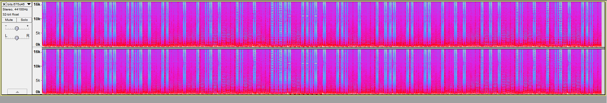

# Beats by Dr. K
###### 55 Points

### Problem
Dr. K just released her new EP -- download her [track](https://2018.pactf.com/static/ctfproblems/1b2c440a-37e0-4500-bd85-c88e2ebba3a5/bits.675c46a10049.wav) now!

### Hint
Listen to each bit...

### Writeup
The music is great itself, but there's something about the beat... There is a very distinct and rhythmic about it. In Audacity (or any other audio editting software) you should be able to see the Spectrogram view of the audio.

It's fairly safe to assume these are bits, ones and zeros. If you take the blue sections as zero: `01100110011011000110000101100111011010010111001101110000011000010110001101110100011001100110110101110101011100110110100101100011` and you convert from binary to ascii, your result is `flagispactfmusic`.

If you take the blue sections as one, it's fine, you will get `10011001100100111001111010011000100101101000110010001111100111101001110010001011100110011001001010001010100011001001011010011100` and result with unreadable ascii. Just reverse the order! 

###### Flag: flagispactfmusic
